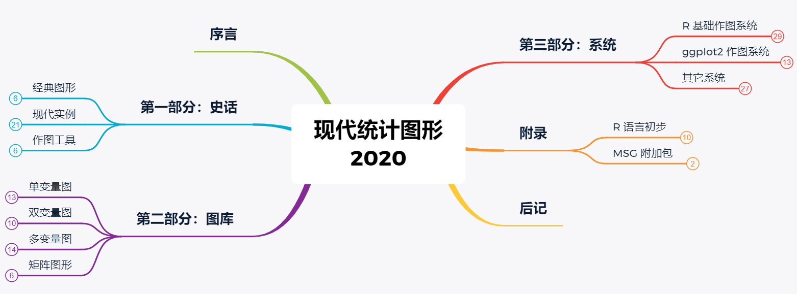
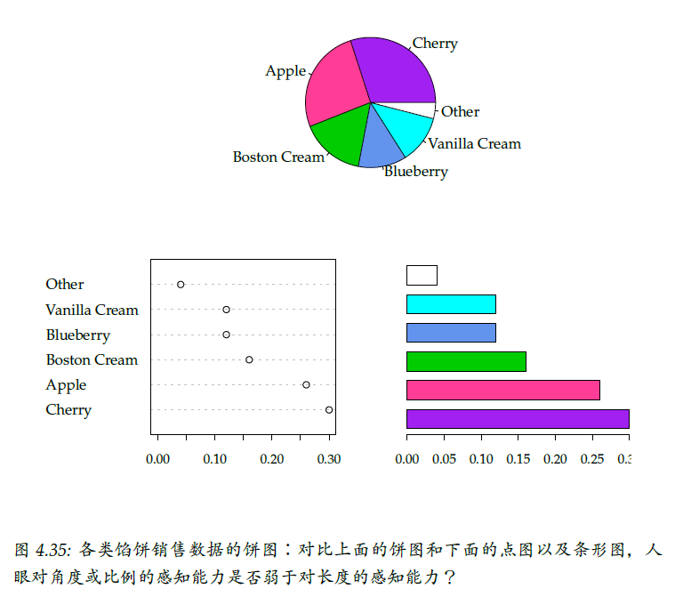
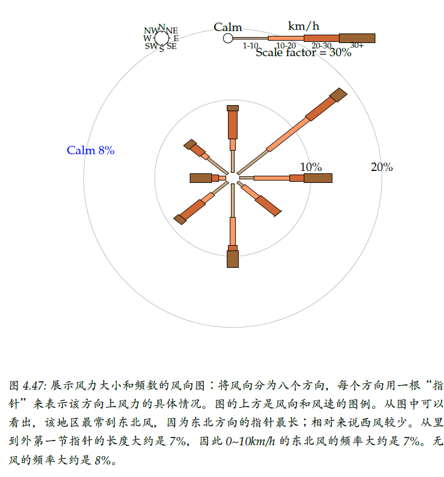
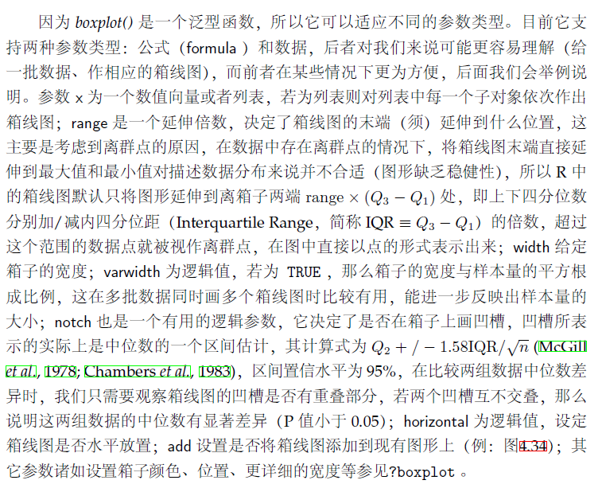

# msg2020 版有哪些新内容

---

[TOC]

## 结构变动

### 章节结构改动

旧版为 7 章+ 4 个附录 。

新版分为三部分，12 章，无附录。主要改动为：

- 把实例（漂亮的图形）提前在第一部分，而在第二部分逐个介绍图形之后引入 R 代码，把具体的技术细节合并在第三部分。
- 把“数据案例”和“统计模拟”两节适当增删合并，提升为独立的一章“现代实例”。
- 把“图库”一章拆为四章。
- 把“元素”、“程序初步”、“细节技巧”三章适当增删合并，成为“R 基础作图系统”一章。
- 把 “ggplot2 图形”一节适当增删，提升为独立的一章。
- “三足鼎立”和“背景地图”两节移至“图海”，改为“三元图”和“地图”。

新版大纲：

### 小节内的改动

- “现代实例”中每个例子都是先提出问题（案情回放），再亮出图形（探案过程），最后给出作图方法（探案工具）。

- “图海”每种图形都是先介绍概念，再举出实例，最后给出代码。

## 内容增删

### 新增小节

- “现代实例”一章新增“新冠疫情”、“论坛热度”；
- “图海”新增“风玫瑰图”
- "作图工具"新增“R 语言的使用”

### 更新与新增图片

旧版 138 图，绝大多数插图替换为 **ggplot** 系统。新版增至 154 图。

### 新增数据表

旧版几乎没有表格，均以代码显示。新版增加数据表格 40 个，方便读者对数据有直观了解后再看图。

### 删除小节

删除“程序初步”、“图形界面”、“本书 R 包”、“动态图形与交互式图形”四个小节。仅在相关章节简述。

## 文字与格式

### 代码格式

旧版以 `usage()` 引出打印的单色代码。新版去掉了这个环节，直接亮代码。

### 个别文字

详见书稿。

### 段落格式

连续多个逗号的大段文字重新划分句子。函数参数介绍段落重新列表。

## 新版更多详情

见[修订方案和进度](https://github.com/XiangyunHuang/MSG-Book/issues/88)。

## 新旧版对比举例

> 旧版：

> 新版：

---

> 旧版：

> 新版：

---

> 旧版：

> 新版：

---

> 旧版：

> 新版：

---
> 旧版：

> 新版：

---

> 新版新增“新冠疫情”：

> 新版新增“洛阳铲”：
